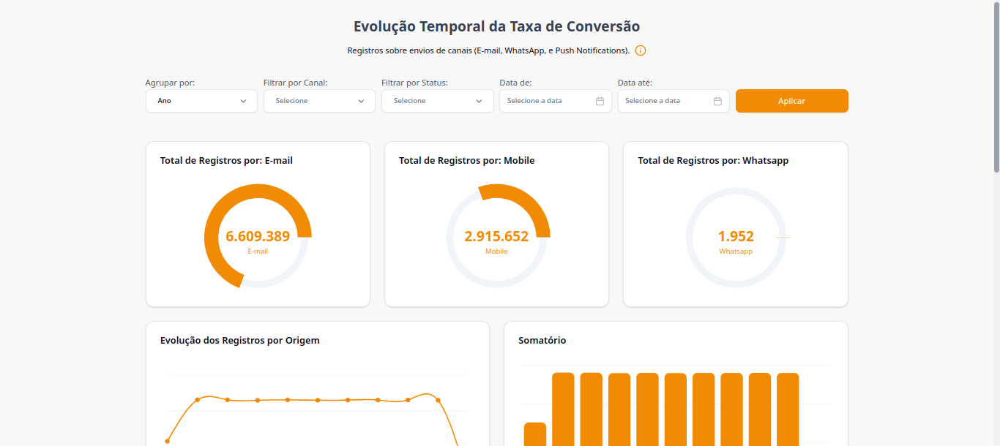

# Dashboard de Monitoramento de Envios

Um dashboard frontend para monitoramento e análise de envios de mensagens por canais (E-mail, WhatsApp e Push Notification). Construído com React, Vite, Tailwind CSS, Shadcn/UI, Axios e Zod, oferece uma interface responsiva e interativa para visualizar métricas de campanhas.

---

## 📋 Índice

- [Sobre o Projeto](#sobre-o-projeto)
- [Funcionalidades](#funcionalidades)
- [Tecnologias Utilizadas](#tecnologias-utilizadas)
- [Pré-requisitos](#pré-requisitos)
- [Instalação](#instalação)
- [Uso](#uso)
- [Estrutura do Projeto](#estrutura-do-projeto)
- [Contribuição](#contribuição)
- [Autor](#autor)
- [Licença](#licença)

---

## 📊 Sobre o Projeto

Este dashboard frontend permite que equipes visualizem o desempenho de envios de mensagens, exibindo métricas como taxas de entrega e aberturas. Ele consome dados de uma API (via Axios) e apresenta visualizações interativas em uma interface estilizada.

**Objetivo**: Proporcionar uma experiência de usuário fluida e intuitiva para monitoramento de campanhas, com gráficos e tabelas responsivas.

---

## ✨ Funcionalidades

- Visualização de envios por canal (E-mail, WhatsApp, Push Notification) em gráficos e tabelas.
- Interface responsiva e acessível com Tailwind CSS e Shadcn/UI.
- Requisições à API com Axios para dados.
- Validação de formulários e dados com Zod.
- Componentes interativos baseados em Radix UI para navegação e filtros.

---

## 🛠 Tecnologias Utilizadas

- **Frontend**:
  - React (com Vite)
  - Tailwind CSS
  - Shadcn/UI (baseado em Radix UI)
  - Axios (para requisições HTTP)
  - Zod (validação de esquemas)
- **Ambiente**:
  - Node.js (v20)
  - npm (gerenciador de pacotes)

---

## 📝 Pré-requisitos

Antes de começar, certifique-se de ter instalado:

- [Node.js](https://nodejs.org/) (v20)
- [npm](https://www.npmjs.com/)

**Nota**: O dashboard requer uma API backend configurada para fornecer os dados de envios. Consulte a documentação do backend para detalhes.

---

## 🚀 Instalação

1. Clone o repositório:
   `git clone https://github.com/reisvitt/temporal-evolution.git`
   ` cd temporal-evolution`

2. Instale as dependências:
   `npm install`

3. Configure as variáveis de ambiente:

   - Crie um arquivo `.env` na raiz do projeto.
   - Adicione a URL da API (ex.: `VITE_API_URL=http://localhost:3000/api`).

4. Inicie o servidor ou dashboard:
   `npm run dev`

5. Acesse o dashboard em: `http://localhost:5173` (porta padrão do Vite ou a configurada).

---

## 🖥 Uso

1. **Acesse o Dashboard**: Abra o navegador e vá para o endereço local ou hospedado.
2. **Explore as Visualizações**:
   - Veja envios por canal em gráficos de barras ou tabelas.
   - Analise métricas de engajamento (ex.: aberturas).
3. **Interaja**: Use filtros para segmentar dados por período ou canal.
4. **Consulte a Documentação**: Clique no ícone "Sobre" no dashboard para detalhes sobre dados e objetivo.

---

## 📂 Estrutura do Projeto

- `public/` : Arquivos estáticos (ex.: favicon, assets)
- `src/` : Código-fonte do frontend
- `tailwind.config.js` : Configuração do Tailwind CSS
- `vite.config.js` : Configuração do Vite
- `README.md` : Documentação do projeto
- `package.json` : Dependências e scripts
- `.env` : Variáveis de ambiente (ex.: URL da API)

---

## 🤝 Contribuição

Contribuições são bem-vindas! Siga os passos abaixo:

1. Faça um fork do repositório.
2. Crie uma branch para sua feature:
   `git checkout -b minha-feature`
3. Commit suas alterações:
   ` git commit -m "Adiciona minha feature"`
4. Envie para o repositório remoto:
   `git push origin minha-feature`
5. Abra um Pull Request.

---

## 👤 Autor

**Vitor Reis**

- GitHub: [github.com/reisvitt](https://github.com/reisvitt)
- E-mail: [reis.vitt@gmail.com](mailto:reis.vitt@gmail.com)

---

## 📜 Licença

Este projeto está licenciado sob a [MIT License](LICENSE).
